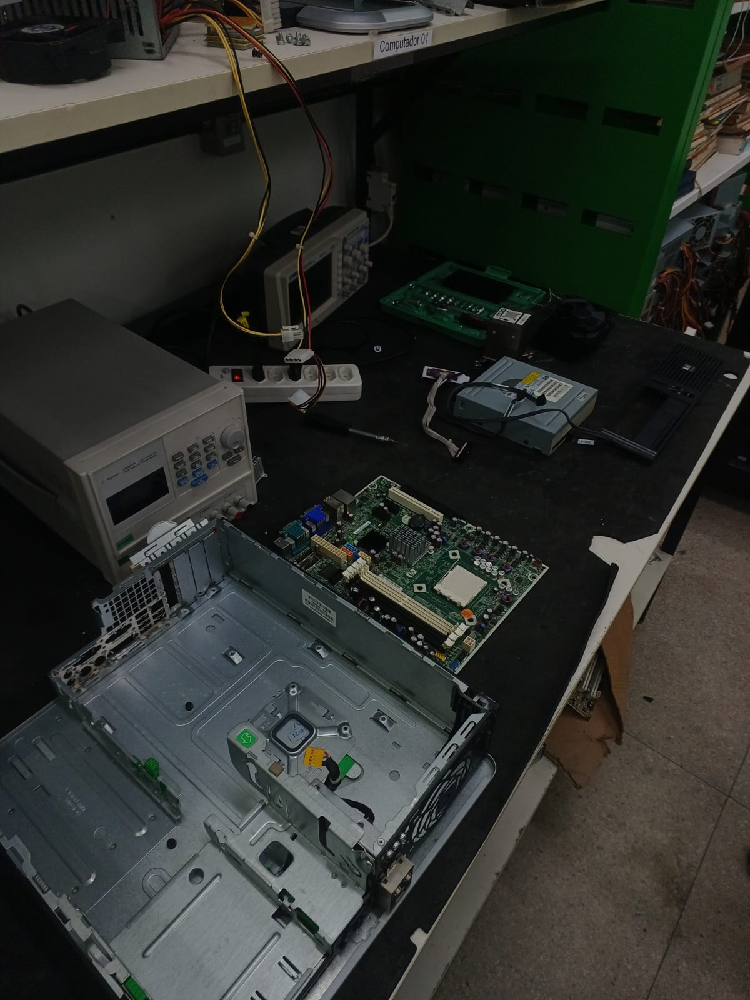
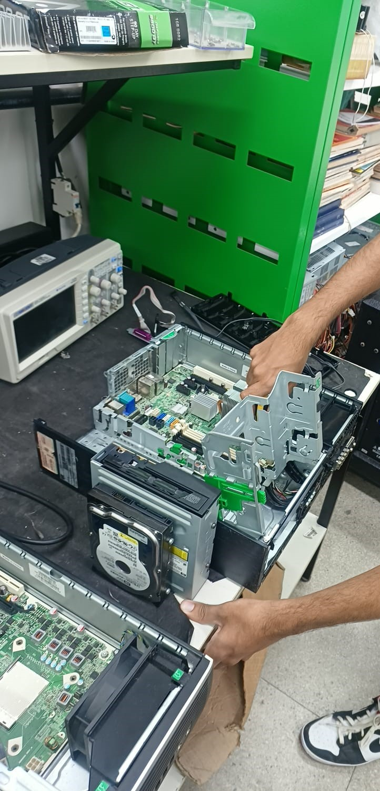
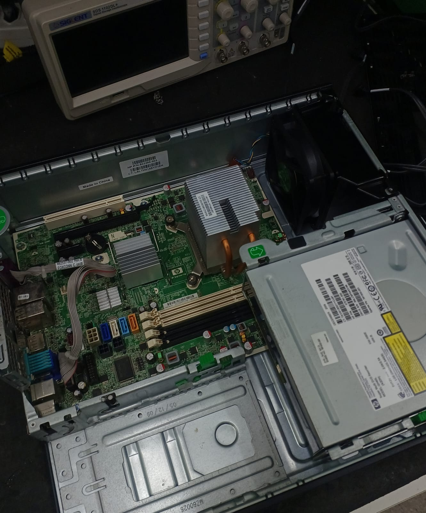

# Tutorial de Desmontagem e Montagem de Hardware

**Integrantes da Dupla:**
- David Harlley Sousa Sarinho
-Carlos Eduardo Bezerra de Brito Oliveira

---

## 1. Introdução

Compreender o funcionamento interno de um computador vai além da teoria: exige colocar as mãos na massa. Este guia prático documenta todo o processo de **desmontagem e remontagem de um computador de secretária**, registado durante a nossa atividade prática de laboratório.

O objetivo principal deste tutorial é desmistificar a arquitetura de hardware, oferecendo um roteiro passo a passo claro, seguro e visual para qualquer pessoa que deseje aprender sobre manutenção preventiva, substituição de peças ou simplesmente entender como cada componente se conecta dentro da máquina.

### 🛠️ Ferramentas Utilizadas
- **Chave Philips / Fenda:** Para fixação e remoção dos parafusos do gabinete e placas.
- **Pulseira Anti-estática:** Para prevenção contra descargas elétricas que possam danificar os circuitos.
- **Pincel de Cerdas Macias:** Para limpeza e remoção de poeira acumulada nas peças.
- **Pasta Térmica:** Para garantir a correta dissipação de calor entre o processador e o cooler.

### 🧩 Componentes Analisados
- **Gabinete (Chassis):** Estrutura de proteção e acomodação dos componentes.
- **Placa-Mãe (Motherboard):** A placa principal que interliga todos os módulos.
- **Processador (CPU):** O cérebro do sistema responsável pelo processamento de dados.
- **Sistema de Refrigeração (Cooler):** Módulo de dissipação térmica do processador.
- **Memória RAM:** Módulos de memória volátil de alta velocidade.
- **Unidade de Armazenamento (SSD / HDD):** Dispositivo de armazenamento permanente de dados.
- **Fonte de Alimentação (PSU):** Unidade responsável pelo fornecimento e distribuição de energia.

---

## 2. Passo a Passo da Desmontagem

> ⚠️ **Aviso de Segurança:** Certifique-se de que a fonte de alimentação está desligada da tomada antes de abrir a caixa.

1. **Desconexão de Periféricos e Abertura:** Desligar todos os cabos externos e remover os parafusos do painel lateral da caixa.
2. **Remoção da Fonte de Alimentação:** Desconectar os cabos ATX (24 pinos), CPU e SATA, desparafusar e remover a fonte.
3. **Remoção da Memória RAM e Armazenamento:** Soltar as travas dos slots de RAM e retirar os discos (SSD/HDD).
4. **Remoção do Cooler e Processador:** Retirar o sistema de refrigeração, abrir a alavanca do socket e remover o processador com cuidado.

---
Visão Geral da Desmontagem**  
  
*Figura 1: Visão geral do computador e componentes após o processo de desmontagem.*  

## 3. Passo a Passo da Montagem

1. **Instalação da Placa-Mãe:** Posicionar a placa-mãe na caixa sobre os espaçadores e fixar com os parafusos.
2. **Instalação do Processador e Cooler:** Encaixar o processador no socket alinhando o triângulo indicativo, aplicar a pasta térmica e fixar o cooler no conector `CPU_FAN`.
3. **Encaixe das Memórias e Discos:** Inserir os módulos RAM nos slots até ouvir o clique de travamento e parafusar as unidades de armazenamento nas baias.
4. **Conexão de Cabos e Fonte:** Fixar a fonte de alimentação, ligar os cabos de energia da placa-mãe, discos e painel frontal.

---
Processo de Montagem**  
  
*Figura 3: Encaixe dos componentes e organização interna do computador.*  

---

 Computador Totalmente Montado**  
  

> 🔒 **Nota de Privacidade e Proteção de Dados:** Todas as imagens utilizadas focam exclusivamente nas peças, ferramentas e mãos em execução, em conformidade com as regras da atividade (sem exibição de rostos ou dados pessoais sensíveis)[cite: 1].
